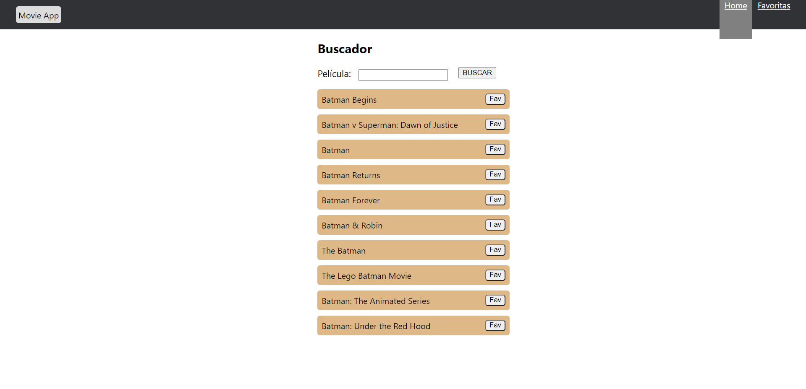
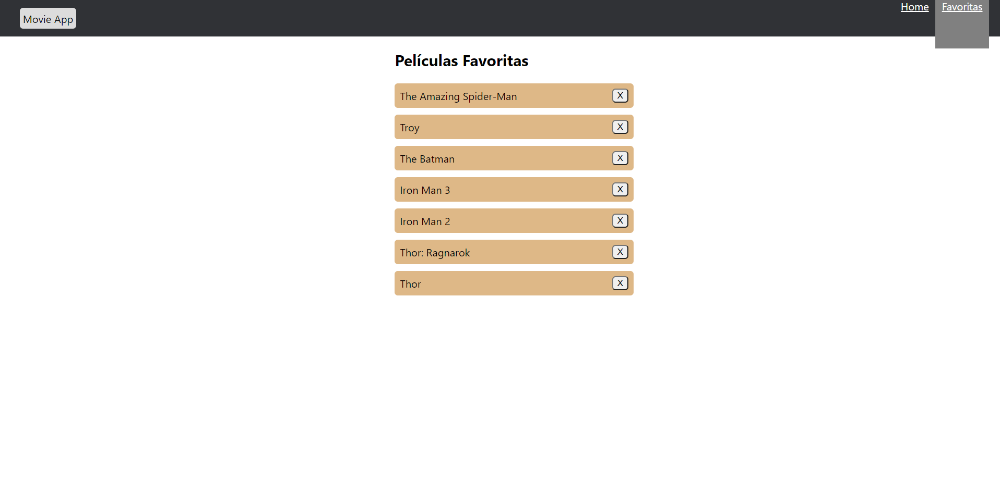

# Movie App

La app consiste de una página principal donde podemos buscar cualquier tipo de películas y obtenemos todas las que coinciden con el nombre buscado. Podemos obtener mas información de cada una de ellas, también seleccionarlas como favoritas y almacenarlas en otro apartado donde podemos ver nuestras peliculas favoritas.

 

Página principal con listado de películas que coinciden con la busqueda relizada, cada una de las películas posee un botón para seleccionarla como favorita

 

Apartado donde podemos ver nuestra lista de películas favoritas, cada una con su respectivo botón para poder sacarlas de la lista

 

Detalle de la película

<h3 align="left">Herramientas utilizadas:</h3>

     

